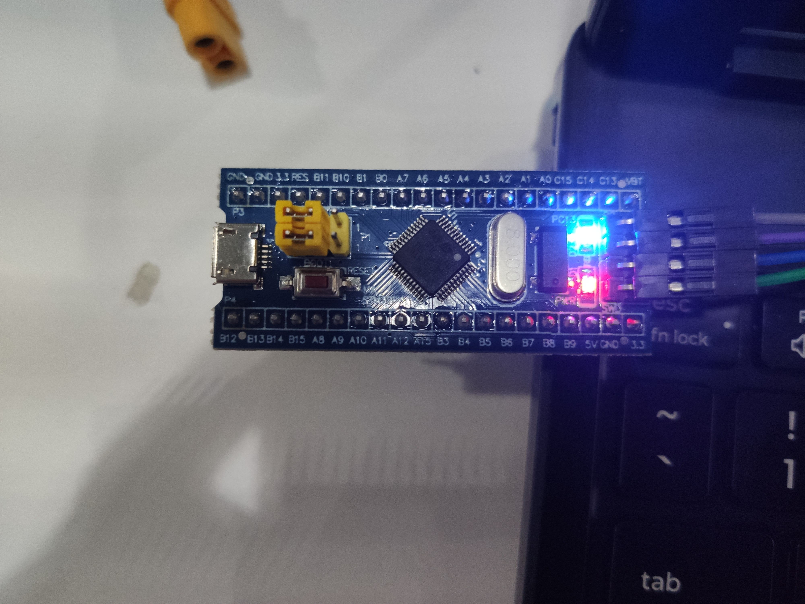
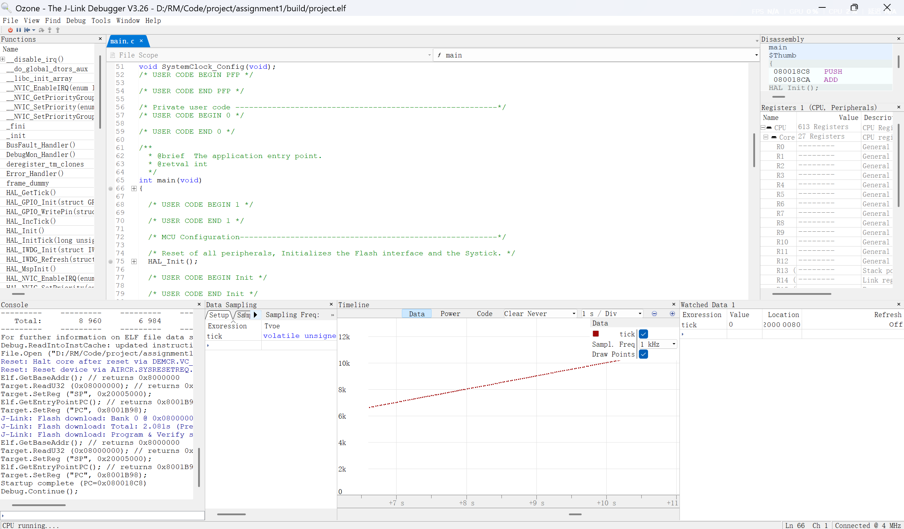
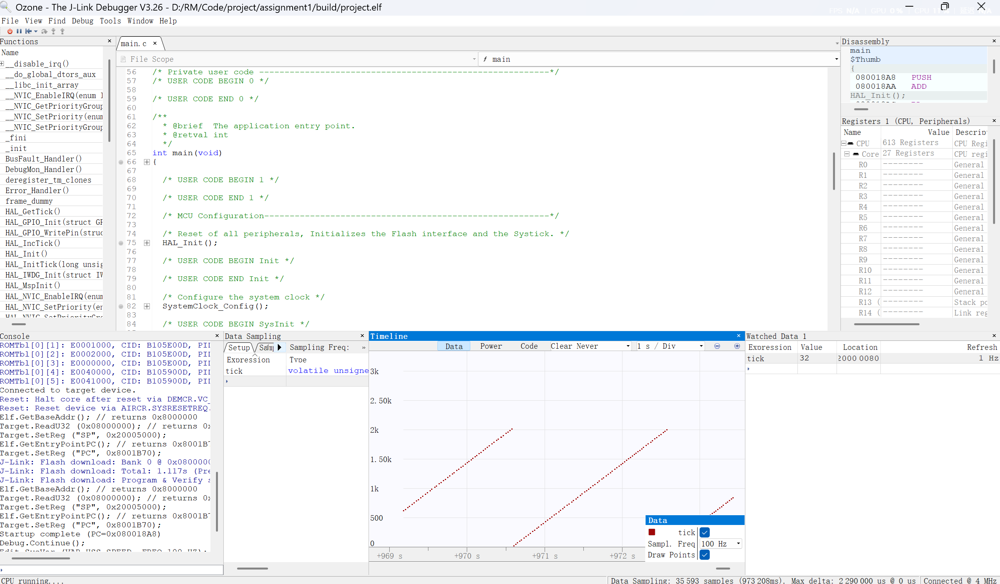

# 电控第一次作业
## 第一题

## 第二题

Tasks 回调：`void HAL_TIM_PeriodElapsedCallback()` 放在 `Tasks/src/timer_task.c`， 实现计数器累加和喂狗

PSC、ARR 的计算：定时器时钟来源：TIM2 挂在 APB1 上，定时器时钟 = APB1 × 2 = 36MHz × 2 = 72MHz。

72 Hz, 1000次：

`(PSC+1) × (ARR+1) / 72,000,000 = 0.001`

取 PSC = 71，ARR = 999：72 × 1000 / 72,000,000 = 1ms。

## 第三题

